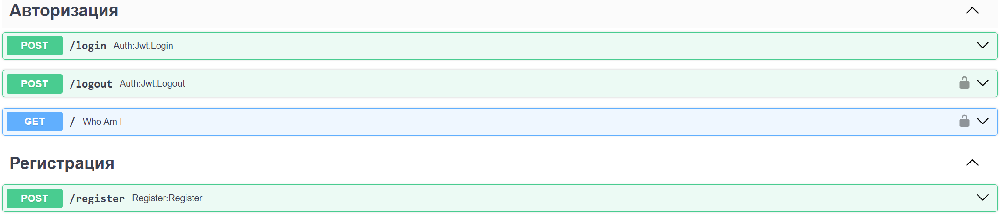
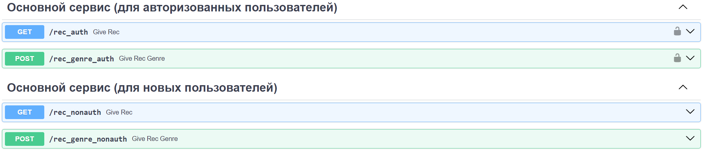
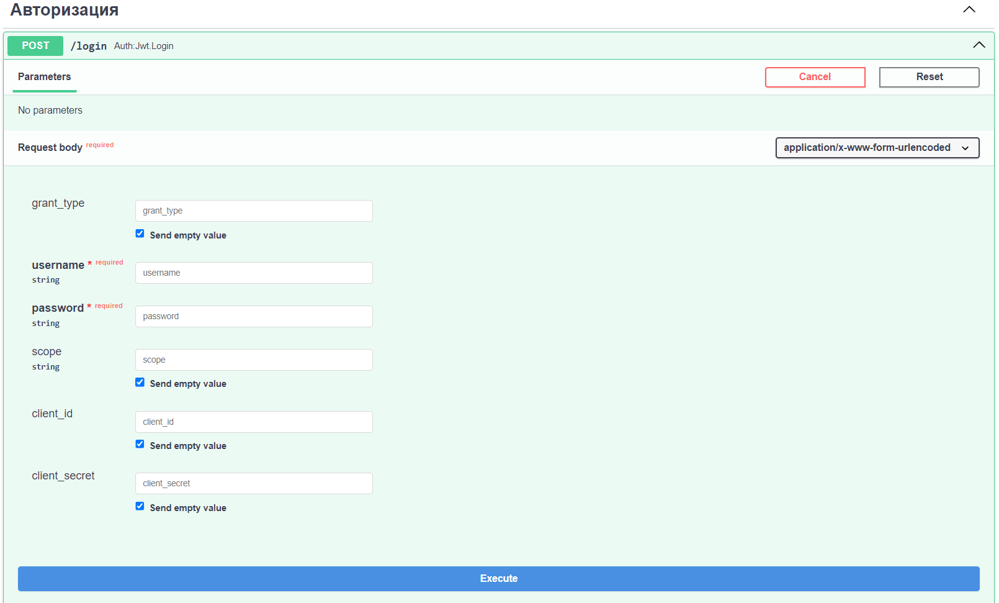

# Рекомендации по фильмам для пользователей на fastqpi
[ссылка на работающий сервис](https://api-docker-4ked.onrender.com)
для просмотра возможностей допишите в адресной строке браузера /docs

## Что есть внутри сервиса?
1. Само приложение на fastapi
2. БД на postresql
3. Redis для кэширования результатов выдач
4. pgAdmin если развернуть локально через docker compose up --build (прикрутил для удобства работы с БД)

## Что умеет делать сервис?
1. Авторизация и регистрация для пользователей - необходимы для разделения существующих и "холодных" пользователей 

2. Основной функционал (поделен на 2 категории по логике существующий/"холодный пользователь)
    
* ручка give_rec - выдает топ-5 фильмов: просто наживаем кнопку - получаем рекомендацию для пользователя
* give_rec_genre - топ-5 фильмов по жанру: тут необходимо ввести жанр на англ (например action).
Если не угадаете с жанром, то вызовется ошибка, перечисляющая доступные жанры

## Как работаем с функционалом?
### Первый путь - для авторизованных
1. Заполняем поля username и password (примера можно взять одного из тестовых пользователей: login:test195@mail.com | pass:test)

2. После успешного логина можем удостовериться, что зашли в систему вызвав ручку Who Am I.
3. После этого переходим к основному функционалу: give_rec просто/give_rec_genre

### Второй путь - для НЕавторизованных
1. Т.к. мы не авторизованы, то можем сразу перейти к основному функционалу: give_rec просто/give_rec_genre
2. Также есть процедура регистрации пользователя

## Как запустить проект локально?
0. Написать мне в тг(@aragosu) для получения конфигурационных файлов (если необходимо) 
1. Клонируем себе репозиторий на свою машину
2. Запускаем Docker (или Docker desktop - да, я делал проект на винде **прошу не ругать**)
3. В терминале прописываем docker compose up --build

## О чем важно упомянуть?
Т.к. хостинг бесплатный (выбирал в учебных целях), то:
1. Первый запуск сервиса (когда переходите по ссылке), может занять некоторое время;
2. Если сервис не получает запросов в течении 50 сек., то он отключается и переводится в состояние описанное в 1п.;
3. Периодически сервис упирается в лимит памяти и может не вызвать ручку.
в логах вылетает нечто подобное - 
